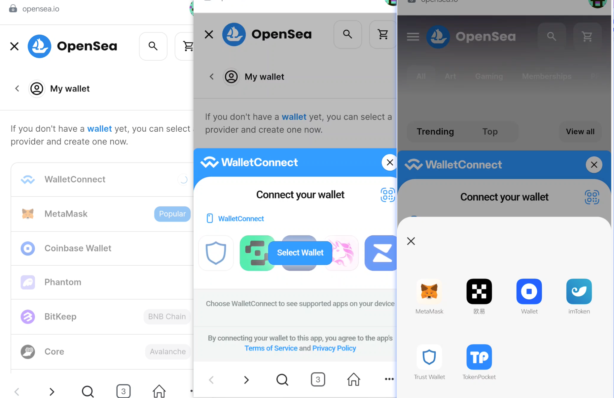
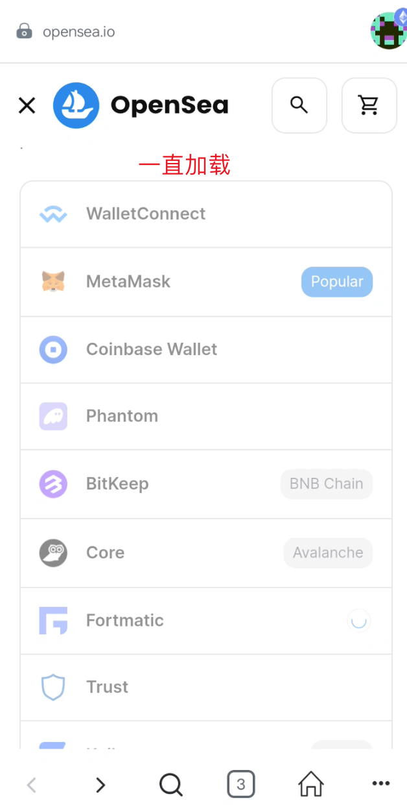
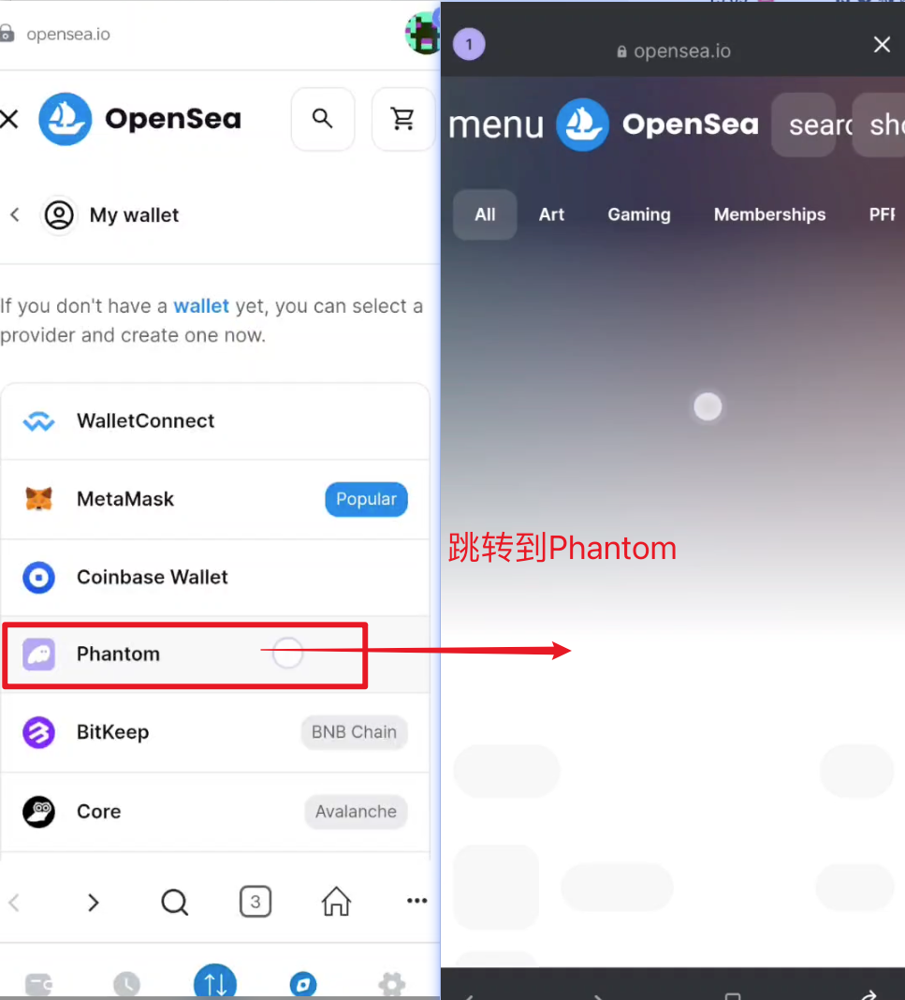
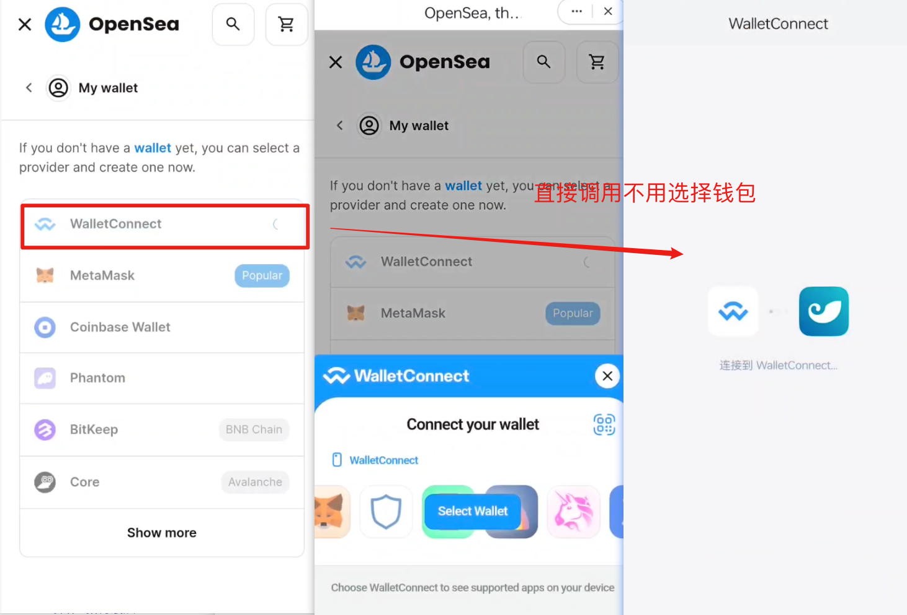
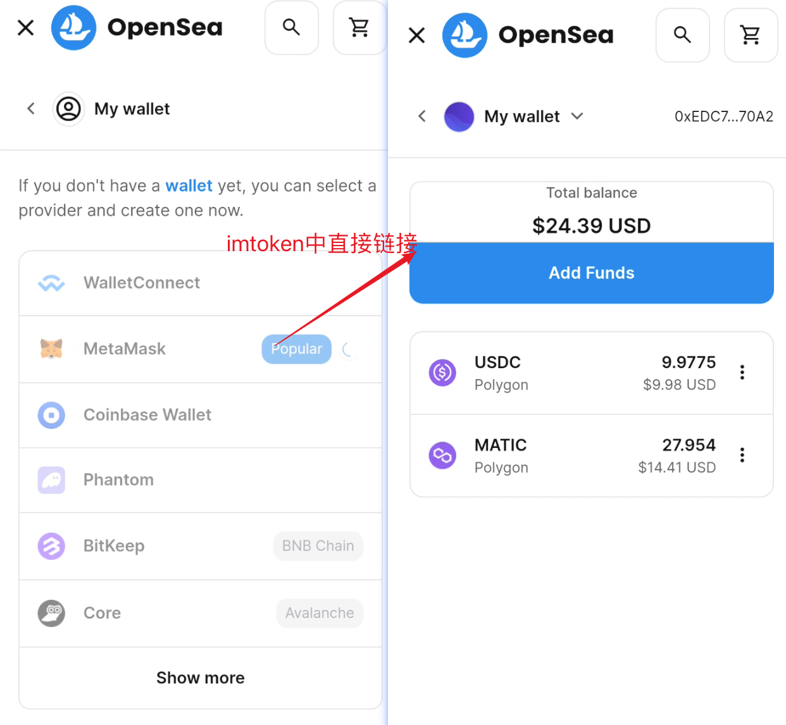

移动端钱包连接总结：

同一个网站在不同的移动端钱包中访问有不同的问题（可能与钱包本身的内置浏览器有关），以opensea为例。opensea本身支持walletconnect连接与网页提供固定支持的几种钱包连接，这也是大多数dapp支持的方式比较有代表性，以下是各钱包链接登录的情况：

### metamask wallet

在metamask的内置浏览器打开并连接钱包时，点击调用walletconnect会将用户手机中的钱包应用获取以供用户选择调用签名的钱包，在其他钱包中能够正常签名登录。

点击连接当前钱包则直接调用钱包签名过程，点击网页提供的固定的其他钱包时会自动跳转到对应的钱包中打开dapp网页（在设备上如果有该钱包的话），在没有该钱包时跳转到钱包官网下载相关钱包，或者网页钱包（部分会一直卡在连接钱包部分）

### imToken wallet

在imToken中点击walletconnect时就只会调用本身钱包连接并不会显示其他已安装的钱包列表，

另外在imToken浏览器中点击网站中固定支持的metamask钱包连接的时候，并没有连接metamask而是连接imToken中当前地址。

imtoken在固定的连接选项中的表现与metamask一样。

### coinbase wallet

在coinbase钱包中无法调用到walletconnect（无法调用对应功能停留在原先页面），

<video src="/Users/a123/Desktop/work/othervscode/mdbookDoc/src/img/446_1695626176.mp4"></video>

点击固定支持的钱包时会跳转到应用商店中搜索应用或者跳转到相应钱包的下载网站无论是否安装对应钱包（相关链接方式有phantom、trust、kaikas、Bitski、opera touch）。部分会在点击后无法调用对应钱包停留在原先页面（BitKeep、core），另外一部分会卡在连接钱包页面(Fortmatic)。相关各部分表现与上述截屏表现的一致

### 欧易钱包

欧易钱包中的钱包连接情况与imToken类似，与imtoken同样的操作表现相同

**PS:**coinbase已经安装的情况下，其他钱包中点击连接coinbase钱包的时候在最开始的时候能够跳转到coinbase APP中，后面不知是什么情况无法自动转到APP中打开，且会超时连接

**总结：**在以上几种钱包中对同一dapp软件签名表现均有不同其中coinbase 钱包对相关应用的签名登录支持适配较弱，imToken与欧易对相关dapp应用签名登录适配较好

以上是部分使用较多的钱包对于签名登录的表现情况。